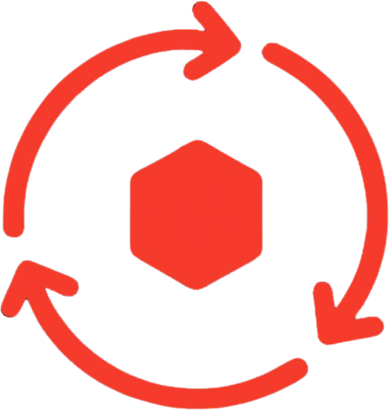

<p align="center">
    
</p>

<p align="center">
    
</p>
# Laravel Idempotency

Laravel Idempotency provides a framework-native way to protect write operations from accidental duplicate execution.

Using an `Idempotency-Key`, the package guarantees that the same logical request is processed only once while safely replaying the original HTTP response to subsequent retries.

It is particularly useful for:

- Payment processing
- Subscription management
- Order creation
- Inventory updates
- Account changes
- External API integrations

---

# Why?

Retries happen.

Mobile applications retry requests.

Browsers retry requests.

Load balancers retry requests.

Network failures cause clients to send the same request multiple times.

Without idempotency, a single retry can accidentally create duplicate:

- payments
- orders
- invoices
- subscriptions

Laravel Idempotency ensures that identical requests execute exactly once.

---

# Features

- HTTP idempotency middleware
- Atomic request locking
- Request fingerprinting
- Automatic response replay
- Configurable response expiration
- Pluggable storage implementation
- Custom fingerprint strategies
- Laravel-native dependency injection
- Fully tested

---

# Requirements

- PHP 8.5+
- Laravel 13
- Cache driver supporting atomic locks

For distributed deployments, use a shared cache such as Redis or the database cache driver.

---

# Installation

```bash
composer require adilazhari/laravel-idempotency
```

Laravel automatically discovers the service provider.

Publish the configuration:

```bash
php artisan vendor:publish --tag=idempotency-config
```

---

# Quick Start

Protect any endpoint with the middleware.

```php
use AdilAzhari\LaravelIdempotency\Http\Middleware\IdempotencyMiddleware;
use Illuminate\Support\Facades\Route;

Route::post('/payments', CreatePaymentController::class)
    ->middleware(IdempotencyMiddleware::class);
```

Clients simply send an idempotency key.

```http
POST /payments
Idempotency-Key: payment-123

{
    "amount": 1000,
    "currency": "MYR"
}
```

The first request executes normally.

Subsequent identical requests return the previously stored response without executing the controller again.

---

# How It Works

```
                Client
                   │
                   ▼
      Idempotency Middleware
                   │
     Generate Request Fingerprint
                   │
          Acquire Execution Lock
                   │
        Existing Stored Response?
          │                  │
         Yes                No
          │                  │
          ▼                  ▼
 Replay Stored Response   Execute Controller
                             │
                             ▼
                      Store HTTP Response
                             │
                             ▼
                        Release Lock
                             │
                             ▼
                        Return Response
```

---

# Request Matching

A request is considered identical when all of the following match:

- Idempotency key
- HTTP method
- Request path
- Query parameters
- Parsed request body

The default implementation uses `Sha256RequestFingerprinter`.

Example:

```http
POST /payments

{
    "amount":1000
}
```

and

```http
POST /payments

{
    "amount":2000
}
```

are treated as different requests, even if they use the same idempotency key.

If the same key is reused for different request data, an `IdempotencyConflictException` is thrown.

---

# Configuration

```php
return [

    'header' => 'Idempotency-Key',

    'lock' => [
        'seconds' => 10,
    ],

    'expiration' => 86400,

];
```

| Option | Description |
|----------|-------------|
| `header` | Header containing the idempotency key |
| `lock.seconds` | Maximum lock duration |
| `expiration` | Lifetime of stored responses |

Choose a lock duration that comfortably exceeds the expected execution time of protected endpoints.

---

# Extending

Laravel Idempotency is built around contracts, allowing individual components to be replaced.

## Custom Request Fingerprinting

```php
$this->app->bind(
    RequestFingerprinter::class,
    CustomFingerprinter::class,
);
```

Possible use cases:

- Ignore selected fields
- Include custom headers
- Different hashing strategy

---

## Custom Response Storage

```php
$this->app->bind(
    IdempotencyStore::class,
    DatabaseIdempotencyStore::class,
);
```

Possible implementations:

- Redis
- Database
- DynamoDB
- External storage service

---

## Custom Locking

```php
$this->app->bind(
    IdempotencyLock::class,
    RedisIdempotencyLock::class,
);
```

Possible implementations:

- Redis locks
- Database locks
- Distributed lock services

---

# Design Principles

Laravel Idempotency is intentionally built around a small set of principles.

- Framework-native integration
- Explicit contracts
- Predictable behaviour
- Simple public API
- Testability
- Extensibility

---

# Testing

Run the complete test suite.

```bash
composer test
```

The package includes automated tests covering:

- Response replay
- Conflict detection
- Expired responses
- Lock handling
- Middleware integration
- Service provider bindings
- Configuration

Current test coverage exceeds **90%**.

---

# Roadmap

- ✅ Laravel 13 support
- ✅ Configurable request fingerprinting
- ✅ Cache-backed storage
- ✅ Atomic request locking
- ⏳ Database storage driver
- ⏳ Redis storage driver
- ⏳ Laravel 14 support

---

# Contributing

Contributions, ideas, and bug reports are welcome.

Please open an issue before submitting significant changes so the implementation can be discussed first.

---

# License

Laravel Idempotency is open-source software licensed under the MIT License.
